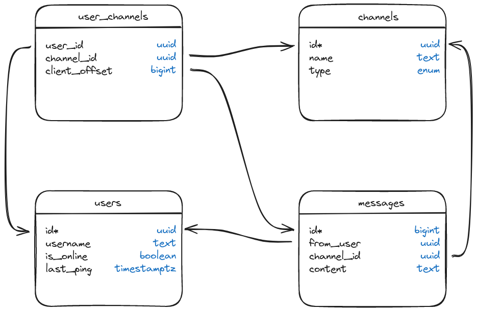

# Socket.IO chat platform

A basic chat platform based on [Socket.IO](https://socket.io/) with:

- channel-based messages:


- and private messages:


Table of contents:

<!-- TOC -->
* [How to use](#how-to-use)
* [Development](#development)
  * [Server](#server)
  * [Client](#client)
* [Data model](#data-model)
* [Licence](#licence)
<!-- TOC -->

## How to use

```shell
$ docker compose up -d
```

Then go to http://localhost:8080

## Development

### Server

```shell
$ cd server

# start the PostgreSQL database
$ docker compose up -d

# start the server
$ npm run dev
```

### Client

```shell
$ cd vue-client

# start the client
$ npm run dev
```

Then go to http://localhost:5173

## Data model

<picture>
  <source media="(prefers-color-scheme: dark)" srcset="./assets/data_model_dark.png">
  
</picture>

## Licence

[MIT](./LICENSE)
